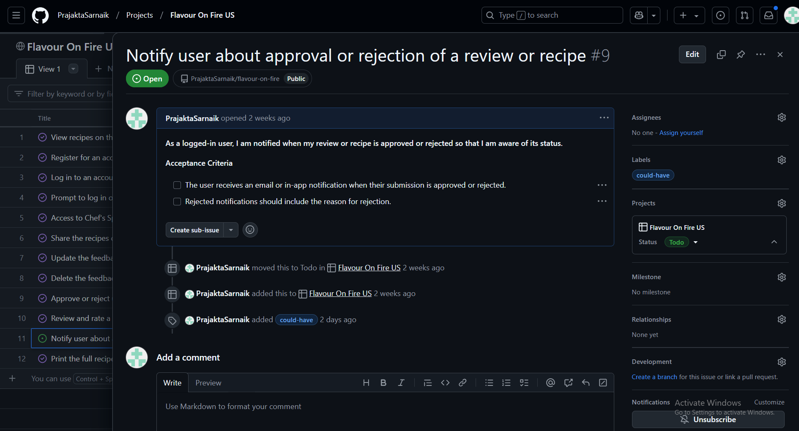

# Flavour On Fire

<p align="center">
| <a href="https://flavour-on-fire-1bb1fc2c2e8e.herokuapp.com/" target="_blank">Flavour On Fire Project</a> |
</p>


## Introduction
Flavour On Fire is an engaging and vibrant online platform designed for culinary enthusiasts, home cooks, and professional chefs to share, explore and celebrate the art of cooking. Whether you’re a seasoned chef or someone experimenting in the kitchen for the first time, Flavour On Fire brings together a diverse community passionate about food from all cultures and traditions.

At its core, the project allows users to share their unique recipes, discover chef’s specials and connect with culinary creators around the globe. The platform offers an intuitive interface for uploading detailed recipes, including ingredients, step-by-step instructions and captivating images of culinary creations. Users can also browse and get inspired by dishes from fellow food lovers, participate in discussions and view recipes from their favorite chefs.


## Table of Contents

- [Flavour On Fire](#flavour-on-fire)
  - [Introduction](#introduction)
  - [Table of Contents](#table-of-contents)
- [UX - User Experience](#ux---user-experience)
  - [Design Inspiration](#design-inspiration)
    - [Wireframes](#wireframes)
    - [Colour Scheme](#colour-scheme)
    - [Font](#font)
- [Project Planning](#project-planning)
  - [Project Flow](#project-flow)
  - [Strategy Plane](#strategy-plane)
    - [Site Goals](#site-goals)
- [Agile Methodologies - Project Management](#agile-methodologies---project-management)
    - [MoSCoW Prioritization](#moscow-prioritization)
    - [User Stories](#user-stories) 
- [Surface Planes](#surface-planes)
    - [Website Features](#website-features)
    - [Database Schema - Entity Relationship Diagram](#database-schema---entity-relationship-diagram)
    - [Security](#security)
- [Features](#features)
  - [User View - Registered/Unregistered](#user-view---registeredunregistered)
  - [CRUD Functionality](#crud-functionality)
  - [User Notification](#user-notification)
  - [Future Features](#future-features)
- [Technologies \& Languages Used](#technologies--languages-used)
  - [Libraries \& Frameworks](#libraries--frameworks)
  - [Tools \& Programs](#tools--programs)
- [Testing](#testing)
- [Deployment](#deployment)
  - [Connecting to GitHub](#connecting-to-github)
  - [Django Project Setup](#django-project-setup)
  - [Cloudinary API](#cloudinary-api)
  - [Postgre SQL](#postgre-sql)
  - [Heroku deployment](#heroku-deployment)
- [AI Assistance in Development](#ai-assistance-in-dvelopment)
- [Credits](#credits)
  


# UX - User Experience

## Design Inspiration
The design inspiration for Flavour On Fire stems from the vibrant aesthetics of food culture and the dynamic experience of cooking itself. The warm color palette reflects the rich tones of natural ingredients and the heat of the kitchen, creating an inviting atmosphere. High-quality imagery, clean typography, and intuitive layouts were influenced by the visual appeal and storytelling commonly found in culinary spaces. The balance between a modern, minimalistic design and a cozy, home-like feel ensures the platform is both professional and approachable. Overall, the design captures the passion, creativity, and community spirit that define the culinary world.

### Wireframes

[Balsamiq](https://balsamiq.com/?gad_source=1&gclid=CjwKCAiAh6y9BhBREiwApBLHC0jMpx6kH3JjotDkFcIMUXwk7OeEREAduS6O84rCL3cecis-LOkWQhoCSscQAvD_BwE) wireframes were used during the design phase of Flavour On Fire to quickly sketch and plan the layout of the website. This tool allowed me to create low-fidelity mockups of the user interface, focusing on the structure and functionality rather than visual details. Using Balsamiq, I was able to efficiently map out key features and navigation flows, helping to clarify how users would interact with the site. The simple, hand-drawn style of the wireframes made it easier to iterate quickly, gather feedback and refine the design before moving into more detailed stages of development. This approach facilitated better collaboration and ensured that the design met the core user needs early in the process.

#### Large Screen View:


#### Tablet View:


#### Mobile View:


### Colour Scheme


### Font
The fonts used in Flavour On Fire are carefully selected to ensure a balance between readability, elegance, and personality. For the main body text and overall website structure, the website utilizes Google’s default font, sans-serif font known for its clean and modern appearance. Its simple yet professional style ensures that the content is easy to read across all devices and screen sizes, making it perfect for presenting recipe instructions, ingredient lists, and general text.

For the video carousel captions, we’ve chosen Courgette, a stylish script font that adds a personal, handwritten touch.

<hr>

# Project Planning

## Project Flow


## Strategy Plane
Initially, the project focused on establishing a community-driven platform where users can easily share and discover recipes, as well as interact with chefs and other food enthusiasts. The design phase concentrated on creating an appealing and user-friendly interface, with an emphasis on visual storytelling and intuitive navigation. Once the design was finalized, the technical development phase involved implementing features such as recipe submission forms, search capabilities, and secure user accounts. After the launch, a continuous feedback loop was established to improve and iterate the platform based on real user input, ensuring it remains relevant and dynamic.

### Site Goals
- Recipe Sharing and Exploration.
- Community Engagement.
- Showcase Chef Expertise.
- User-Friendly Experience.
- Content Creation and Interaction.
- Sustainability and Growth.

<hr>

# Agile Methodologies - Project Management

THE project followS Agile planning methods. The project board I created [Github Project Board](https://github.com/users/PrajaktaSarnaik/projects/9) helped track tasksand prioritize features. As the project progressed, I added more user stories and refined to better capture evolving needs and feedback. I’m confident that with the experience gained, the process will be more smooth and efficient next time.

### MoSCoW Prioritization

- **Must Haves**: the 'required', critical components of the project. Completing my 'Must Haves' helped me to reach the MVP (Minimum Viable Product) for this project early, allowing me to develop the project further than originally planned.
  
- **Should Haves**: the components that are valuable to the project but not absolutely 'vital' at the MVP stage. The 'Must Haves' must receive priority over the 'Should Haves'.
- **Could Haves**: these are the features that are a 'bonus' to the project, it would be nice to have them in this phase, but only if the most important issues have been completed first and time allows.


### User Stories

Link to the Flavour on Fire [project board](https://github.com/users/PrajaktaSarnaik/projects/9/views/1?layout=board)

| User Story | Priority |
|----------------------------------------------------------------------------------------------------------------------------|---------------|
| As a **user**, I can **register for an account** so that **I can log in and access features like reviewing, rating, and sharing recipes.** | **MUST HAVE** |
| As a **user**, I can **log in to my account** so that **I can use all the features of the website.** | **MUST HAVE** |
| As a **user**, I can **view recipes on the website** so that I can **explore new dishes to try.** | **MUST HAVE** |
| As a **logged-in user**, I can **review and rate a recipe so that I can share my feedback and help others decide which recipes to try.** | **MUST HAVE** |
| As a **logged-in user**, I can **edit my reviews** so that **I can update my feedback if needed.** | **MUST HAVE** |
| As a **logged-in user**, I can **delete my reviews** so that **I can remove feedback I no longer wish to share.** | **MUST HAVE** |
| As an **admin**, I can **approve or delete user reviews and recipes** so that **only appropriate content is published on the website.** | **MUST HAVE** |
| As a **visitor**, I am **prompted to log in or register if I try to review, rate, or submit a recipe** so that **unauthorized actions are prevented.** | **MUST HAVE** |
| As a **logged-in user**, I can **submit my own recipes** so that **I can share them with the community.** | **SHOULD HAVE** |
| As a **registered user**, I can **log in to access the Chef's Special page,** so that **I can view exclusive special recipes that are not available on the public index page.** | **SHOULD HAVE** |
| As a **As a user**, I want to **print a story from the application**, so that **I can have a physical copy for offline reading or sharing.** | **COULD HAVE** |
| As a **logged-in user**, I am **notified when my review or recipe is approved or rejected** so that **I am aware of its status.** | **COULD HAVE** |
<hr>

# Surface Planes

## Website Features

### Navbar
- The navigation bar is displayed at the top of the page. 
- It includes the logo and title, which redirect to the homepage when clicked. 
- The navbar links direct the user to the relevant pages when clicked.


### Homepage
- The homepage displays all recipes. 
- Each recipe is displayed with a title, image, description and diet.


### Recipe Details
- The recipe details page displays the title, image, description, ingredients, instructions, reviews and rating of a recipe. 
- Logged-in users can review and rate the recipe. Users can also edit or delete their reviews.
- Users can directly access reviews section by clicking on comments icon.


### Register
- Unregistered users can register for an account by providing a username, email, and password. 
- Passwords are hashed for security. 
- The text boxes validate the user's input to ensure data is in the correct format. 


### Log In
- Users can log in to their account using their username and password. 
- Passwords are hashed for security. 
- The text boxes validate the user's input to ensure data is in the correct format. 


### Log Out
- Users can log out of their account. 
- They are redirected to the homepage after logging out.


### Review a Recipe
- Logged-in users can review and rate a recipe. 
- They can provide a review text and a rating from 1 to 5 stars.


### Edit Review
- Logged-in users can edit their reviews. 
- They can update the review text and rating.


### Delete Review
- Logged-in users can delete their reviews. 
- They are prompted to confirm the deletion.


### Print Recipe
- Logged-in users can print a recipe from the application to have a physical copy for offline reading or sharing.


### Our Chef
- Users can access the Our Chefs page to view information about the chef, including a bio and image. 


### Chef's Special
- Logged-in users can access the Chef's Special page to view exclusive special recipes that are not available on the public index page.


### Share a Recipe
- Logged-in users can submit their own recipes. 
- They must provide a title, image, description, ingredients, instructions and diet.


**Admin Panel**

Through Django's built-in Administration Panel, the Admin has full access over the data submitted to the website by registered Users. To access the Admin panel the Admin user adds '/admin/' to the end of the URL to display [https://flavour-on-fire-1bb1fc2c2e8e.herokuapp.com/admin/](https://flavour-on-fire-1bb1fc2c2e8e.herokuapp.com/admin/). A username and password is requested. For Flavor On Fire, Admin approval is needed for articles and comments to keep the site on topic and to prevent spamming. Registered, logged-in users' have instant access to make a booking and upload images.


*Django Admin panel view for Flavor On Fire Administrator - content selection menu on left hand side*  

Users recipes and reviews require approval by the Admin of Flavor On Fire to keep the website content on topic. 

#### Dropdown menu allowing Admin to 'publish' a users article, 'Save' button must be clicked to confirm

*Admin can change the status of recipes from 'Draft' to 'Published'.*
 
#### Checkbox for allowing Admin to 'approve' a users comment, 'Save' must be clicked to confirm
 
*Admin can approve the reviews.*
 
## Database Schema - Entity Relationship Diagram 

The database schema for the Flavour On Fire project was designed using an Entity Relationship Diagram (ERD). This diagram visually represents the database structure, including the tables, fields and relationships between entities. The ERD for Flavour On Fire includes the following entities: User, Recipe, Review,  and Author(Chef). Each entity has specific attributes and relationships to other entities, forming a coherent and organized database schema. The ERD provides a clear overview of the database structure, facilitating the development and maintenance of the project.


## Security

A number of security steps were taken in this project in order to protect the user's submitted data. Unlike a strictly informative website, Flavour on Fire allows the user to become part of the community and to write reviews and share recipes. To meet the strict internet standards of protecting a user's data, the following processes were included in the project's development.

**AllAuth**  

Django AllAuth is an installable framework that takes care of the user registration and authentication process. Authentication was needed to determine when a user was registered or unregistered and it controlled what content was accessible on Flavour on Fire. The setup of AllAuth included:

- installing it to my workspace dependencies
- adding it to my INSTALLED_APPS in my settings.py
- sourcing the AUTHENTICATION_BACKENDS from the AllAuth docs for my settings.py
- adding its URL to my projects 'urls.py'
- run database migrations to create the tables needed for AllAuth

- **User Authentication**: Users can register for an account, log in, log out, and reset their password. Passwords are hashed using Django's built-in hashing library.
- **Permissions**: Users can only edit or delete their own reviews and recipes. Admins can approve or delete reviews and recipes.
- **Cross-Site Request Forgery (CSRF) Protection**: CSRF tokens are used in forms to prevent unauthorized requests.

**Defensive Design**  

Flavour on Fire was developed to ensure a smooth user experience, to the best of my current learning experience with Django. 

- Input validation and error messages provide feedback to the user to guide them towards the desired outcome. 
- Unregistered users are diverted to the Sign Up page from restricted access pages. 
- Authentication processes control edit/delete icons to reveal them to the content author only. 
- Deletion of data is confirmed through an additional modal, double-checking with the user.
- Testing and validation of features completes the process.

<hr>

# Features

## User View - Registered/Unregistered

From the very beginning, it was important that Flavour On Fire be accessible to unregistered users in meaningful ways. The goal was to engage new visitors quickly by allowing them to explore community-driven content such as recipes, print feature and enticing them to become part of the platform. By offering valuable information upfront, the site aims to foster interest and encourage user registration for deeper interaction. Below is a breakdown of the site's accessibility for both registered and unregistered users:

| **Feature**       | **Unregistered User**                                                                 | **Registered, Logged-In User**                                              |
|-------------------|--------------------------------------------------------------------------------------|-----------------------------------------------------------------------------|
| **Home Page**     | Visible                                                                              | Visible                                                                     |
| **Recipes**       | Visible but not interactable via 'Rating/Reviews' | Visible with full feature interaction, including the ability to Rate, Review, Edit and Delete own reviews |
| **Recipe Details**       | Visible and shows full recipe in detail with the facility of printing the recipe | Visible and shows full recipe in detail with the facility of printing the recipe |
| **Recipe Share**       | Visible but not interactable to share their own recipes on the website | Visible with full feature interaction, including the ability to share their own recipes |
| **Chef's Special**| Not visible until logged in                       | Visible all the chef's exclusive recipes with full feature interaction available                             |
| **Our Chefs**       | Visible with all the details                             | Visible with all the details                              |   


## CRUD Functionality

The CRUD (Create, Read, Update, Delete) functionality is a core feature of Flavour On Fire, allowing users to interact with the platform in a dynamic and engaging way. Users can create, view, edit and delete content, such as rating, reviews, to share their feedback with the community. The CRUD functionality enhances user participation and collaboration, enabling users to contribute to the platform's content and engage with other food enthusiasts. Below is a summary of the CRUD features available on Flavour On Fire:

| **Feature**       | **Create** | **Read** | **Update** | **Delete** |
|-------------------|------------|----------|------------|------------|
| **Ratings**       | Yes- Created upon registration or login        | Yes      | Yes- Created upon registration or login        | Yes        |
| **Reviews**       | Yes- Created upon registration or login        | Yes      | Yes-Created upon registration or login        | Full review deletion is available upon registration and login, the comments dashboard clears the review automatically if a user deletes the review       |

## User Notification

THe website uses Django message features for success and error messages to enhance user experience by providing clear, immediate feedback for all critical interactions on the website.

- **Comment Update Notifications:**
When a user successfully updates a comment, a Django success message is triggered, informing them that their comment has been updated. This message is typically displayed at the top of the page in a styled alert box, ensuring immediate visibility.


*Django success message*


*Personalized user message*


- **Comment Deletion Notifications:**
Upon deleting a comment, the user receives a confirmation success message indicating that the comment has been removed. This feedback helps assure users that their action was completed successfully.

- **Recipe and Review Submission Feedback:**
When users submit a recipe or review, they are notified of the status through success or error messages. If the submission is successful, a confirmation message is shown. If there's an issue (e.g., missing required fields), an error message highlights the problem.

## Future Features

For future development of the Flavour On Fire website, several features could enhance user engagement and improve overall functionality. 

- **Notify user about approval or rejection of a review or recipe**



- **Recipe Bookmarking and Favorites:** Introducing a bookmarking feature will allow users to save their favorite recipes in personalized folders or categories. This will make it easier for them to revisit dishes they love without having to search for them again. Users could also create custom collections, such as “Weeknight Dinners” or “Holiday Favorites,” to organize their saved recipes according to different themes or occasions.

- **Advanced Search and Filtering:** Implementing a robust search and filtering system will significantly improve user experience by allowing visitors to quickly find recipes that meet their specific criteria. Users could filter recipes based on dietary preferences (like vegetarian, vegan, gluten-free), preparation time, difficulty level, cuisine type, or even by ingredients they already have at home. This feature would make the platform more user-friendly, catering to both novice cooks and seasoned chefs looking for inspiration.

- **Meal Planner and Shopping List Generator:** A meal planner tool would let users create weekly or monthly meal schedules directly from the available recipes. Once meals are selected, the system could automatically generate a consolidated shopping list, organized by ingredient type (e.g., produce, dairy, spices). This not only simplifies meal preparation but also saves time and reduces food waste, as users will buy exactly what they need for their planned dishes.

- **User Profiles with Activity History:** Enhancing user profiles to include activity history will create a more personalized experience on the platform. Users will be able to view their submitted recipes, track reviews and ratings they've given or received, and access their bookmarked or favorited recipes. This feature would foster a sense of ownership and engagement, encouraging users to be more active within the community. It could also include badges or milestones to celebrate user contributions, such as the number of recipes shared or reviews written.

# Technologies & Languages Used

- HTML 5
- CSS
- JavaScript
- Python
- [Git](https://git-scm.com/) used for version control.
- [Github](https://www.github.com) used for online storage of codebase and Projects tool.
- [Balsamiq](https://balsamiq.com/?gad_source=1&gclid=CjwKCAiAh6y9BhBREiwApBLHC0jMpx6kH3JjotDkFcIMUXwk7OeEREAduS6O84rCL3cecis-LOkWQhoCSscQAvD_BwE) for project design planning and wireframe creation.
- [Django](https://www.djangoproject.com/) was used as the Python framework for the site.
- [Cloudinary](https://cloudinary.com/) was used for cloud media storage of user uploaded images.
- [PostgreSQL](https://www.postgresql.org/) was used to host the PostgreSQL database needed to collect and recall the users data.
- [Heroku](https://www.heroku.com) was used to host the FLavor On Fire application.

## Libraries & Frameworks

- Bootstrap v5.3.3
- Django v5.1.5
- Django AllAuth v0.57.2
- Django Crispy Forms v2.3
- Crispy Bootstrap5 v0.7
- Django Summernote v0.8.20.0
- whitenoise v5.3.0

# Testing

- For all testing, please refer to the [TESTING.md](TESTING.md) file.

# Deployment

## Connecting to GitHub

### Step 1: Install Prerequisites

Make sure you have the following installed:

- **Python** (Django requires Python 3.6 or later)
- **Git** (for version control and GitHub integration)
- **Visual Studio Code (VSCode)** (code editor)
- **Django** (you will install it later)
- **GitHub Account** (for hosting your repository)

If you don't have these tools, you can download and install them:

- Python: [Download Python](https://www.python.org/downloads/)
- Git: [Download Git](https://git-scm.com/downloads)
- VSCode: [Download VSCode](https://code.visualstudio.com/)
- GitHub: [Sign up for GitHub](https://github.com/)

### Step 2: Set Up a GitHub Repository

1. **Create a new repository on GitHub:**
   - Go to [GitHub](https://github.com/).
   - Click on **New** to create a new repository.
   - Provide a repository name, description, and set it to either public or private.
   - Do not initialize the repository with a README, license, or .gitignore (you will do this later).

2. **Copy the repository URL:**
   - After the repository is created, copy the HTTPS URL (e.g., `https://github.com/username/repository-name.git`).

### Step 3: Set Up Visual Studio Code

1. **Open VSCode:**
   - Launch Visual Studio Code.

2. **Install Python Extension for VSCode:**
   - Press `Ctrl+P` (or `Cmd+P` on macOS) and type `ext install ms-python.python` to install the Python extension.
   - This will enable features like IntelliSense, debugging, and linting for Python.

3. **Install Git Extension for VSCode:**
   - VSCode usually comes with Git support by default, but you can also check if it is installed by typing `git` in the command palette (`Ctrl+Shift+P` or `Cmd+Shift+P`) and confirming the Git-related actions are available.

### Step 4: Clone the GitHub Repository Locally

1. **Clone the repository to your local machine:**
   - Open the terminal in VSCode (`Ctrl+` or `Cmd+`).
   - Navigate to the directory where you want to clone the project.
   - Run the following command:
     ```bash
     git clone https://github.com/username/repository-name.git
     ```
   - Replace `username/repository-name` with your GitHub repository name.
   
2. **Navigate into the cloned repository:**
   ```bash
   cd repository-name

## Django Project Setup

1. Install Django and supporting libraries: 
   
- ```pip3 install 'django<4' gunicorn```
- ```pip3 install dj_database_url psycopg2```
- ```pip3 install dj3-cloudinary-storage```  
  
2. Once you have installed any relevant dependencies or libraries, such as the ones listed above, it is important to create a **requirements.txt** file and add all installed libraries to it with the ```pip3 freeze --local > requirements.txt``` command in the terminal.  
3. Create a new Django project in the terminal ```django-admin startproject freefido .```
4. Create a new app eg. ```python3 mangage.py startapp booking```
5. Add this to list of **INSTALLED_APPS** in **settings.py** - 'booking',
6. Create a superuser for the project to allow Admin access and enter credentials: ```python3 manage.py createsuperuser```
7. Migrate the changes with commands: ```python3 manage.py migrate```
8. An **env.py** file must be created to store all protected data such as the **DATABASE_URL** and **SECRET_KEY**. These may be called upon in your project's **settings.py** file along with your Database configurations. The **env.py** file must be added to your **gitignore** file so that your important, protected information is not pushed to public viewing on GitHub. For adding to **env.py**:

- ```import os```
- ```os.environ["DATABASE_URL"]="<copiedURLfromElephantSQL>"```
- ```os.environ["SECRET_KEY"]="my_super^secret@key"```
  
For adding to **settings.py**:

- ```import os```
- ```import dj_database_url```
- ```if os.path.exists("env.py"):```
- ```import env```
- ```SECRET_KEY = os.environ.get('SECRET_KEY')``` (actual key hidden within env.py)  

9. Replace **DATABASES** with:

```
DATABASES = {
    'default': dj_database_url.parse(os.environ.get("DATABASE_URL"))
  }
```

10. Set up the templates directory in **settings.py**:
- Under ``BASE_DIR`` enter ``TEMPLATES_DIR = os.path.join(BASE_DIR, ‘templates’)``
- Update ``TEMPLATES = 'DIRS': [TEMPLATES_DIR]`` with:

```
os.path.join(BASE_DIR, 'templates'),
os.path.join(BASE_DIR, 'templates', 'allauth')
```

- Create the media, static and templates directories in top level of project file in IDE workspace.

11. A **Procfile** must be created within the project repo for Heroku deployment with the following placed within it: ```web: gunicorn freefido.wsgi```
12. Make the necessary migrations again.

## Postgre SQL

1. Navigate to [PostgreSQL](https://dbs.ci-dbs.net/) from Code Institute.
2. Follow the steps on the website. (I referred Code Institute's LMS for this setup)
3. Once the URL is received through an email then follow the steps below:
  - Create new env.py file and add 
    os.environ.setdefault(
        "DATABASE_URL", "<your-database-URL>")
  - Then install
  ```
    pip3 install dj-database-url~=0.5 psycopg2~=2.9
    pip3 freeze --local > requirements.txt
  ```
4. Add the url in settings.py file.
5. Migrate the database.
  ```
    python3 manage.py migrate
  ```

## Cloudinary API 

Cloudinary provides a cloud hosting solution for media storage. All users uploaded images in the FreeFid project are hosted here.

Set up a new account at [Cloudinary](https://cloudinary.com/) and add your Cloudinary API environment variable to your **env.py** and Heroku Config Vars.
In your project workspace: 

- Add Cloudinary libraries to INSTALLED_APPS in settings.py 
- In the order: 
```
   'cloudinary_storage',  
   'django.contrib.staticfiles',  
   'cloudinary',
```
- Add to **env.py** and link up with **settings.py**: ```os.environ["CLOUDINARY_URL"]="cloudinary://...."``` 
- Set Cloudinary as storage for media and static files in settings.py:
- ```STATIC_URL = '/static/'```
```
  STATICFILES_STORAGE = 'cloudinary_storage.storage.StaticHashedCloudinaryStorage'  
  STATICFILES_DIRS = [os.path.join(BASE_DIR, 'static'), ]  
  STATIC_ROOT = os.path.join(BASE_DIR, 'staticfiles')‌  
  MEDIA_URL = '/media/'  
  DEFAULT_FILE_STORAGE = 'cloudinary_storage.storage.MediaCloudinaryStorage'
```
## Heroku deployment

To start the deployment process , please follow the below steps:

1. Log in to [Heroku](https://id.heroku.com/login) or create an account if you are a new user.
2. Once logged in, in the Heroku Dashboard, navigate to the '**New**' button in the top, right corner, and select '**Create New App**'.
3. Enter an app name and choose your region. Click '**Create App**'. 
4. In the Deploy tab, click on the '**Settings**', reach the '**Config Vars**' section and click on '**Reveal Config Vars**'. Here you will enter KEY:VALUE pairs for the app to run successfully. The KEY:VALUE pairs that you will need are your: 
   
   - **CLOUDINARY_URL**: **cloudinary://....** 
   - **DATABASE_URL**:**postgres://...** 
   - **DISABLE_COLLECTSTATIC** of value '1' (N.B Remove this Config Var before deployment),
   -  **PORT**:**8000**
   -  **SECRET_KEY** and value  
  
5. Add the Heroku host name into **ALLOWED_HOSTS** in your projects **settings.py file** -> ```['herokuappname', ‘localhost’, ‘8000 port url’].```
6. Once you are sure that you have set up the required files including your requirements.txt and Procfile, you have ensured that **DEBUG=False**, save your project, add the files, commit for initial deployment and push the data to GitHub.
7. Go to the '**Deploy**' tab and choose GitHub as the Deployment method.
8. Search for the repository name, select the branch that you would like to build from, and connect it via the '**Connect**' button.
9.  Choose from '**Automatic**' or '**Manual**' deployment options, I chose the 'Manual' deployment method. Click '**Deploy Branch**'.
10. Once the waiting period for the app to build has finished, click the '**View**' link to bring you to your newly deployed site. If you receive any errors, Heroku will display a reason in the app build log for you to investigate. **DISABLE_COLLECTSTATIC**  may be removed from the Config Vars once you have saved and pushed an image within your project, as can **PORT:8000**.

<hr>

# AI Assistance in Development

- **Code Autocompletion & Suggestions :**
AI tools like GitHub Copilot have been game-changers for me. They offer real-time code suggestions, which not only speed up development but also help when I’m stuck figuring out syntax or structure. It’s like having a coding buddy who knows every language!

- **Bug Detection & Error Prevention :**
GitHub Copilot have saved me countless hours by catching errors I would’ve missed, especially in large projects. It’s reassuring to know that AI can spot potential vulnerabilities before I even hit run.

- **Automated Testing & Debugging :**
Writing test cases used to be tedious, but with AI generating unit tests, I can focus more on building features. AI-assisted debugging also helps pinpoint tricky issues faster than manually sifting through logs.

- **Automated Code Review & Refactoring :**
AI-powered code review tools help maintain clean and consistent code. They’ve improved my workflow by catching small mistakes and suggesting optimizations I wouldn’t have thought of, making my code more efficient and readable.

# Credits

- [Code Institute](https://learn.codeinstitute.net/dashboard): Throughout the development process, I frequently relied on the 'I Think Therefore I Blog' CI walkthrough project as a helpful resource. Whenever I faced obstacles or needed clarification, I would first review this project and revisit the relevant documentation from earlier lessons on the LMS learning portal for support. With the reference of LMS I customised the models, views and templates to create my own unique website.
- [Django Docs](https://www.djangoproject.com/): For document reference.
- [Bootstrap](https://getbootstrap.com/): For CSS framework and bootstrap icons.
- [Pexels](https://www.pexels.com/): For providing high-quality images.
- [Unsplash](https://unsplash.com/): For providing high-quality images.
- [Microsoft Designer](https://designer.microsoft.com/): For providing high-quality images.
- [Coolors](https://coolors.co/): For generating the color palette used in the application.
- [Am I Responsive](https://ui.dev/amiresponsive): For testing the responsiveness of the application across different devices.
- [Google Fonts](https://fonts.google.com/): For providing the fonts used in the application.
- [Logo Design](https://www.canva.com/) : Created using Canva to reflect the essence of the application.
- [ERD](https://dbdiagram.io/home): For creating the Entity Relationship Diagram (ERD) used in database planning.
- [Balsamiq](https://balsamiq.com/): For wireframe creation.
- [Heroku](https://www.heroku.com/): For hosting the application.
- [PostgreSQL](https://www.postgresql.org/): For database management.
- [Chatgpt](https://chatgpt.com/): For providing high-quality images used in the application

A heartfelt thanks to my mentor Emma and coding coaches Spencer and Roo who guided me throughout this project. Their valuable feedback, support and encouragement were instrumental in shaping this website into its final form.