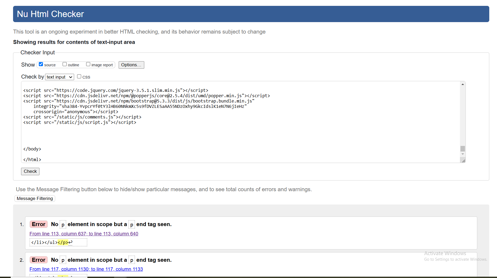

# Testing

This is the TESTING file for the [Flavour On Fire](https://flavour-on-fire-1bb1fc2c2e8e.herokuapp.com/) website.

Return back to the [README.md](README.md) file.

## Testing Contents  
  
- [Testing](#testing)
  - [Testing Contents](#testing-contents)
  - [Validation](#validation)
    - [HTML Validation](#html-validation)
    - [CSS Validation](#css-validation)
    - [JavaScript Validation](#javascript-validation)
    - [Python Validation](#python-validation)
    - [Lighthouse Scores](#lighthouse-scores)
  - [Manual Testing](#manual-testing)
    - [User Input/Form Validation](#user-inputform-validation)
    - [Browser Compatibility](#browser-compatibility)
    - [Testing User Stories](#testing-user-stories)
    - [Dev Tools/Real World Device Testing](#dev-toolsreal-world-device-testing)
  - [Bugs](#bugs)
    - [Known Bugs](#known-bugs)
    
## Validation

### HTML Validation

For my HTML files I have used [HTML W3C Validator](https://validator.w3.org) to validate all of my HTML files.

I have had to follow a different approach for validating my HTML for this project as the majority of my pages are developed using Jinja syntax such as '' and '{{ form|crispy }}' and most require user authentication. The HTML validator will throw errors if I were to use my website's URL so I have had to follow the below approach for every page:

- Via the deployed Heroku app link, I have navigated to each individual page.
- Right clicking on the screen/CTRL+U/⌘+U on Mac, allows a menu to appear, giving me the option to 'View page source'.
- The complete HTML code for the deployed page will appear, allowing you to select the entire code using CTRL+A/⌘+A on Mac.
- Paste the copied code into the [validate by input](https://validator.w3.org/#validate_by_input) option.
- Check for errors and warnings, fix any issues, revalidate by following the above steps and record the results.

All HTML pages were validated and returned a 'No errors or warnings to show' result, except for the recipe detail page. This page pulls content from the database using Summernote, which results in a error related to the 
 tags. However, this issue stems from how Django processes and renders the content, making it unfixable within the current setup.

*This issue stems from how Django processes and renders the content, making it unfixable within the current setup.*

### CSS Validation

I've used the W3C CSS Validator to ensure that my stylesheets are error-free and compliant with web standards, helping improve the overall quality and consistency of my code.

