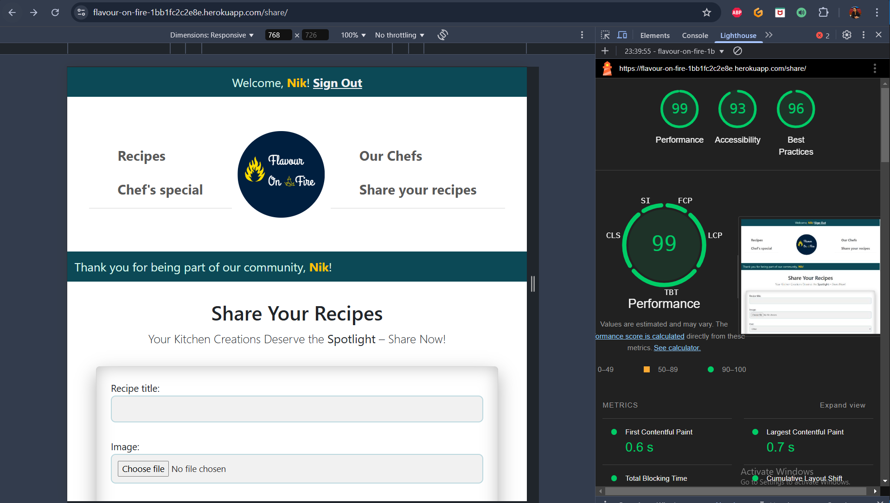

# Testing

This is the TESTING file for the [Flavour On Fire](https://flavour-on-fire-1bb1fc2c2e8e.herokuapp.com/) website.

Return back to the [README.md](README.md) file.

## Testing Contents  
  
- [Testing](#testing)
  - [Testing Contents](#testing-contents)
  - [Validation](#validation)
    - [HTML Validation](#html-validation)
    - [CSS Validation](#css-validation)
    - [JavaScript Validation](#javascript-validation)
    - [Python Validation](#python-validation)
    - [Lighthouse Scores](#lighthouse-scores)
  - [Manual Testing](#manual-testing)
    - [User Input/Form Validation](#user-inputform-validation)
    - [Testing User Stories](#testing-user-stories)
  - [Bugs](#bugs)
    - [Known Bugs](#known-bugs)
    
## Validation

### HTML Validation

For my HTML files I have used [HTML W3C Validator](https://validator.w3.org) to validate all of my HTML files.

I have had to follow a different approach for validating my HTML for this project as the majority of my pages are developed using Jinja syntax such as '' and '{{ form|crispy }}' and most require user authentication. The HTML validator will throw errors if I were to use my website's URL so I have had to follow the below approach for every page:

- Via the deployed Heroku app link, I have navigated to each individual page.
- Right clicking on the screen/CTRL+U/⌘+U on Mac, allows a menu to appear, giving me the option to 'View page source'.
- The complete HTML code for the deployed page will appear, allowing you to select the entire code using CTRL+A/⌘+A on Mac.
- Paste the copied code into the [validate by input](https://validator.w3.org/#validate_by_input) option.
- Check for errors and warnings, fix any issues, revalidate by following the above steps and record the results.

All HTML pages were validated and returned a 'No errors or warnings to show' result, except for the recipe detail page. This page pulls content from the database using Summernote, which results in a error related to the 
 tags. However, this issue stems from how Django processes and renders the content, making it unfixable within the current setup.

*This issue stems from how Django processes and renders the content, making it unfixable within the current setup.*

| HTML Source Code/Page | Errors | Warnings |
| ---- | ------ | -------- | 
| Home | 0 | 0 |
| Sign In | 0 | 0 |
| Sign Out | 0 | 0 |
| Recipe Detail | 1 | 0 |
| Chef's Special | 0 | 0 |
| Our Chefs | 0 | 0 |
| Share your recipe | 0 | 0 |

### CSS Validation

I've used the W3C CSS Validator to ensure that my stylesheets are error-free and compliant with web standards, helping improve the overall quality and consistency of my code.

### JavaScript Validation

[JSHint](https://jshint.com/) was used to validate the small amount of JavaScript code added to the project. External JS, for Bootstrap purposes, obtained via [CDN](https://cdn.jsdelivr.net/npm/bootstrap@5.3.3/dist/js/bootstrap.bundle.min.js) was not validated through JSHint

*Used for print button logic*

 
*Used to edit and update comments*

| Page |  sed For |  Errors | Warnings |
| ---- | ----------- |------ | -------- |
| recipe_detail.html | Used for print button logic | none | none |
| recipe_detail.html | Used to edit and update comments | none | none |

### Python Validation

[CI Python Linter](https://pep8ci.herokuapp.com/#) was used to validate the Python files that were created or edited by myself. No issues presented and line lengths were double checked. I have included some screenshots of validation of python files used within apps.

Please click on **"no errors"** to view respective screenshot.

| Feature | admin.py | forms.py | models.py | urls.py | views.py |
|---------|----------|----------|-----------|---------|----------|
| Recipe | [no errors](static/readme_images/python_validation/recipe_admin_py.PNG) | [no errors](static/readme_images/python_validation/recipe_forms_py.PNG) | [no errors](static/readme_images/python_validation/recipe_models_py.PNG) | [no errors](static/readme_images/python_validation/recipe_urls_py.PNG) | [no errors](static/readme_images/python_validation/recipe_views_py.PNG) |
| Author  | [no errors](static/readme_images/python_validation/author_admin_py.PNG) | N/A | [no errors](static/readme_images/python_validation/author_models_py.PNG) | [no errors](static/readme_images/python_validation/author_urls_py.PNG) | [no errors](static/readme_images/python_validation/author_views_py.PNG) |

Here are some screenshots of validation of python files used within **Flavour** project.

*Validation of Settings.py*

*Validation of project's urls.py*

### Lighthouse Scores

- **Homepage :**

- **Recipe Detail Page :**

- **Our Chefs Page :**

- **Share Recipe Page :**

## Manual Testing

### User Input/Form Validation

| Page | Element | User Action | Expected Outcome | Result | 
| ---- | ------- | ----------- | ---------------- | ------ |
| Sign In | Username | Enters invalid username | Error message 'Enter a valid username' | Pass |
| Sign In | Username | Enters valid email | No error message | Pass |
| Sign In | Password | Enters invalid password | Error message 'Incorrect email or password' | Pass |
| Sign In | Password | Enters valid password | No error message | Pass |
| Sign Out | Sign Out Button | Clicks Sign Out button | Redirected to Home page | Pass |
| Recipe Detail | Add review | Enters comment | Comment displayed | Pass |
| Recipe Detail | Edit review and rating| Clicks edit | Comment editable | Pass |
| Recipe Detail | Update review and rating | Enters updated comment | Comment updated | Pass |
| Recipe Detail | Delete review and rating | Clicks delete | Comment deleted | Pass |
| Share Recipe | Recipe Name | Enters recipe name | Recipe name displayed | Pass |
| Share Recipe | Recipe Description | Enters recipe description | Recipe description displayed | Pass |
| Share Recipe | Ingredients | Enters ingredients | Ingredients displayed | Pass |
| Share Recipe | Directions | Enters directions | Directions displayed | Pass |
| Share Recipe | Upload Image | Uploads image | Image displayed | Pass |
| Share Recipe | Submit | Clicks submit | Recipe added to database | Pass |

### Testing User Stories

| User Story | Feature | User Action | Expected Outcome | Result |
|------------|---------|-------------|------------------|--------|
| As a **user**, I can **register for an account** so that **I can log in and access features like reviewing, rating, and sharing recipes.** | Registration | User fills out registration form and submits | User account is created, and user is logged in | Pass |
| As a **user**, I can **log in to my account** so that **I can use all the features of the website.** | Login | User enters valid credentials and submits | User is logged in and redirected to the home page | Pass |
| As a **user**, I can **view recipes on the website** so that I can **explore new dishes to try.** | View Recipes | User navigates to the home page | Recipes are displayed on the home page | Pass |
| As a **logged-in user**, I can **review and rate a recipe so that I can share my feedback and help others decide which recipes to try.** | Review and Rate Recipe | User submits a review and rating for a recipe | Review and rating are displayed on the recipe detail page | Pass |
| As a **logged-in user**, I can **edit my reviews** so that **I can update my feedback if needed.** | Edit Review | User edits an existing review and submits | Review is updated and displayed on the recipe detail page | Pass |
| As a **logged-in user**, I can **delete my reviews** so that **I can remove feedback I no longer wish to share.** | Delete Review | User deletes an existing review | Review is removed from the recipe detail page | Pass |
| As an **admin**, I can **approve or delete user reviews and recipes** so that **only appropriate content is published on the website.** | Approve/Delete Reviews and Recipes | Admin approves or deletes reviews and recipes | Reviews and recipes are approved or deleted accordingly | Pass |
| As a **visitor**, I am **prompted to log in or register if I try to review, rate, or submit a recipe** so that **unauthorized actions are prevented.** | Prompt to Log In/Register | Visitor attempts to review, rate, or submit a recipe | Visitor is prompted to log in or register | Pass |
| As a **logged-in user**, I can **submit my own recipes** so that **I can share them with the community.** | Submit Recipe | User fills out recipe submission form and submits | Recipe is added to the database and displayed on the home page | Pass |
| As a **registered user**, I can **log in to access the Chef's Special page,** so that **I can view exclusive special recipes that are not available on the public index page.** | Access Chef's Special Page | User logs in and navigates to the Chef's Special page | Exclusive recipes are displayed on the Chef's Special page | Pass |
| As a **user**, I want to **print a story from the application**, so that **I can have a physical copy for offline reading or sharing.** | Print Recipe | User clicks the print button on a recipe detail page | Print dialog is displayed, and user can print the recipe | Pass |

## Bugs 
### Known Bugs

At present, there are no known bugs. However, it has been observed that the **Rating** field in the **"Comment Form"** and the **Image** field in the **"Share Your Recipe"** form are being submitted without any input, as these fields have default values set in the database. In future updates, I will prioritize enhancing the validation process to enforce these fields as mandatory for form submission, ensuring the integrity and completeness of the data collected.

